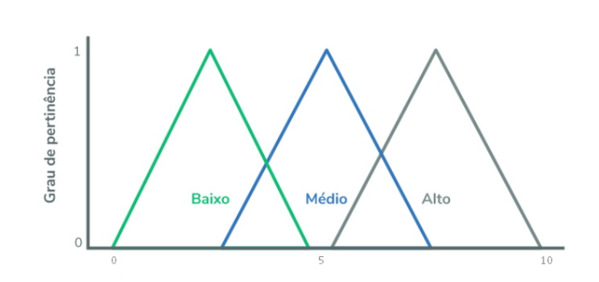
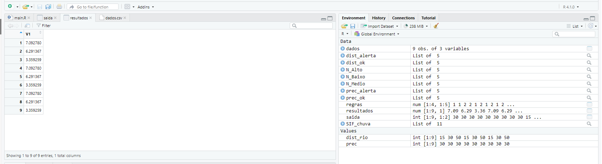

# **Lógica Fuzzy**
------------------------
 - Exemplo aplicação lógica Fuzzy: 
 pensando numa bacia hidrográfica fictícia, onde temos problemas de inundação e gostaríamos de criar um sistema para alertar a população de determinados bairros alvos.
    Para tal sistema, simplificaremos as coisas usando apenas duas variáveis, 
    -  Precipitação e 
    -  Distância do Rio.

A partir delas, iremos desenvolver nosso sistema de inferência difusa.

------------------------
**1.** Importamos/instalamos os pacotes necessários para a autilização.

```R
install.packages("splines")
 
install.packages("FuzzyToolkitUoN")
 
library(splines)
 
library(FuzzyToolkitUoN)

```

 **2.** Carregar uma tabela com os dados necessários para aplicação da Lógica. após carregar ela o programa faz a leitura dos dados.

```R
dados <- read.csv("dados.csv", head=TRUE, sep=",")
 
prec <- dados$precipitacao_mm
 
dist_rio <- dados$dist_rio_m
```
- Dados fornecidos na planilha 

bairro | precipitacao_mm | coludist_rio_mmn2
------- | ------- | -------
Itaum | 30 | 15
Itaum | 30 | 30
Itaum | 30 | 50
Centro | 30 | 15
Centro | 30 | 30
Centro | 30 | 50
Glória | 30 | 15
Glória | 30 | 30
Glória | 30 | 50

 **3.** Agora, vamos utilizar as funções do pacote de lógica difusa, criaremos o sistema de inferência difusa (comando `newFIS`), adicionaremos variáveis de entrada (inputs) e suas funções de pertinência (comandos addVar e addMF, respectivamente).

```R
SIF_chuva <- newFIS("SIF_chuva", FISType="mamdani", andMethod="min", defuzzMethod="centroid")
 
SIF_chuva <- addVar(SIF_chuva, "input", "Precipitação", 0:50)
 
prec_alerta <- trapMF("prec_alerta", 0:50, c(0, 25, 50, 50, 1))
 
prec_ok <- trapMF("prec_ok", 0:50, c(0, 0, 25, 50, 1))
 
SIF_chuva <- addMF(SIF_chuva, "input", 1, prec_alerta)
 
SIF_chuva <- addMF(SIF_chuva, "input", 1, prec_ok)
 
SIF_chuva <- addVar(SIF_chuva, "input", "Distância do Rio", 0:100)
 
dist_alerta <- trapMF("dist_alerta", 0:100, c(0, 0, 25, 50, 1))
 
dist_ok <- trapMF("dist_ok", 0:100, c(25, 50, 100, 100, 1))
 
SIF_chuva <- addMF(SIF_chuva, "input", 2, dist_alerta)
 
SIF_chuva <- addMF(SIF_chuva, "input", 2, dist_ok)  
```

 **4.** Definimos assim duas funções de pertinência do tipo trapezoidal (comando `trapMF`) para cada variável, ou seja, uma função para dizer quando vai inundar e quando não vai inundar.

 Podemos utlizar de exemplo o gráfico abaixo para medir o nível de pertinência

 

 **5.** Agora, vamos seguir os mesmos procedimentos anteriores, só que para criar os parâmetros de saída (outputs).

```R
SIF_chuva <- addVar(SIF_chuva, "output", "Nível de Alerta", 0:10)
#Definimos os valores entre alto, médio e baixo.
N_Alto <- trapMF("Alto", 0:10, c(6, 7, 10, 10, 1))
 
N_Medio <- trapMF("Médio", 0:10, c(3, 5, 6, 7, 1))
 
N_Baixo <- trapMF("Baixo", 0:10, c(0, 0, 3, 5, 1))
 
SIF_chuva <- addMF(SIF_chuva, "output", 1, N_Alto)
 
SIF_chuva <- addMF(SIF_chuva, "output", 1, N_Medio)
 
SIF_chuva <- addMF(SIF_chuva, "output", 1, N_Baixo)
```
-----------------------

A partir dos nossos parâmetros de entrada e de saída, criaremos um sistema de regras das situações possíveis, conferindo para cada situação diferentes níveis de alerta.

> SE Precipitação = Alerta E Distância do Rio = Alerta ENTÃO Nível de Alerta = Alto
> 
> SE Precipitação = Alerta E Distância do Rio = Ok ENTÃO Nível de Alerta = Médio
> 
> SE Precipitação = Ok E Distância do Rio = Alerta ENTÃO Nível de Alerta = Médio
> 
> SE Precipitação = Ok E Distância do Rio = Ok ENTÃO Nível de Alerta = Baixo


Para utilizarmos esse sistema de regras, precisamos converte-lo para uma tabela, logo, teremos na primeira coluna as possibilidades da precipitação (1 = Alerta; 2 = Ok); na segunda as possíveis distâncias do rio (1 e 2); na terceira os níveis de alerta (1 = Alto, 2 = Médio, 3 = Baixo).

Da mesma que importamos nossa tabela de dados, iremos importar nosso sistema de regras, transformando ele posteriormente em matriz (comando as.matrix) e adicionaremos as regras ao nosso sistema de inferência difusa (comando addRule).

```R
regras <- read.csv(file="regras.csv", header=FALSE, stringsAsFactors = FALSE, colClasses="numeric")
 
regras <- as.matrix(regras)
 
SIF_chuva <- addRule(SIF_chuva, regras)
```

Por fim, temos nosso sistema de inferência difusa completo.

Agora iremos criar uma variável com nossos dados de entrada e vamos submete-los ao nosso sistema (comando evalFIS) e verificar se algum bairro esta com nível de alerta alto.


```R
saida <- matrix(c(cbind(prec), cbind(dist_rio)), 9, 2)
 
resultados <- evalFIS(saida, SIF_chuva)

```
# **Resultados**

Analisando a variável resultados, temos três níveis de alerta (7,09; 6,29 e 3,36), onde o primeiro é para locais a 15 metros do rio, ou seja, nessa situação (precipitação de 30 mm) temos um alerta de nível alto (7,09), locais a 30 metros também apresentam um certo nível de alerta (6,29); enquanto locais a 50 metros do rio apresentam risco baixo (3,36). Lembrando que definimos que os níveis de alerta variam entre 0 e 10.



> Créditos/Referência: [Blog 2 Engenheiros](http://2engenheiros.com)


